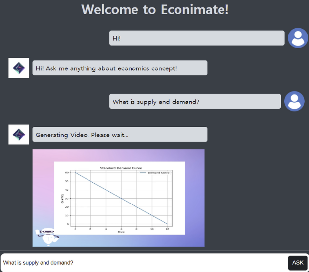
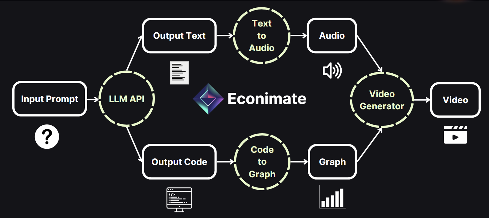

# Econimate

<p align="center">
  
</p>

<h3 align="center">ECONIMATE</h3>

<!-- TABLE OF CONTENTS -->
<details>
  <summary>Table of Contents</summary>
  <ol>
    <li>
      <a href="#about-the-project">About The Project</a>
    </li>
    <li>
      <a href="#getting-started">Getting Started</a>
    </li>
    <li><a href="#usage">Usage</a></li>
    <li><a href="#roadmap">Roadmap</a></li>
    <li><a href="#contact">Contact</a></li>
    <li><a href="#acknowledgments">Acknowledgments</a></li>
  </ol>
</details>

<!-- ABOUT THE PROJECT -->

## About The Project

Have you ever tried to dive into the world of economics, only to find yourself overwhelmed by the countless graphs and complex notes? Well, don't worry! Meet Econimate, your friendly AI tutor that makes learning economic concepts a breeze. Whether you're a student, a professional, or simply curious about the world of economics, Econimate is here as your 24/7 AI tutor, helping you grasp these concepts in a fun and easy-to-understand manner through engaging and informative videos.

Econimate can serve as a valuable learning resource for individuals with disabilities, including those with ADHD, by providing interactive and engaging multimedia elements.

This release extends the functionality of the previous version, which utilized Google PALM2 API, by introducing several advancements. We enhanced overall performance and content by incorporating the advanced GPT-4.0 Turbo model. Additionally, we have implemented a user-friendly UI to elevate the overall user experience.

<!-- GETTING STARTED -->

## Getting Started

### Importing Libraries

1. Follow the **requirements.txt** to install the packages needed for running Econimate and import necessary modules.

   ```js
    import openai
    from openai import OpenAI
    import gtts
    import moviepy.editor as mpy
    import cv2
    import matplotlib.pyplot as plt
    import os
    from gtts import gTTS
    from moviepy.editor import VideoFileClip, concatenate_videoclips, CompositeVideoClip, \
    ImageClip, ColorClip, AudioFileClip, vfx
    import numpy as np
    import shutil
    import pandas as pd
    import subprocess
    import sys
   ```

2. We utilized GPT-4.0 Turbo to assist in generating both the explanation and the code for creating a reference graph. To access the GPT-4.0 Turbo API, you can obtain an API_KEY from [here](https://platform.openai.com/api-keys).

   ```js
   openai.api_key = "ENTER YOUR API";
   ```

<p align="right">(<a href="#readme-top">back to top</a>)</p>

<!-- USAGE EXAMPLES -->

## Usage

To use Econimate, simply run the provided code in your local Python environment and enter your Economics doubts on the prompt and press "ASK". Econimate will then return a video directly ont eh chat that explains the concept in a clear and concise way, using graphs and audio to make your learning easy and fun.

Have a look at our website's UI:

<p align="center">
  
</p>
<p align="center">
  
</p>

Have a look at how amazing [videos](https://github.com/yanhd2019/Final_Project/assets/48376588/a3c8dbe0-e0eb-4059-bdcf-2894b4eccf46) Econimate generates:

<p align="center">
  <video src="./Econimate_video.mp4" width="388">
</p>

Here are some examples of how you can use Econimate:

1. To learn about a new economic concept, such as inflation or supply and demand.
2. To get help with a specific economics assignment or problem.
3. To stay up-to-date on the latest economic news and research.

Econimate is a great resource for anyone who wants to learn more about economics, regardless of the level of expertise. However, please keep in mind that it is still in beta and may not be able to answer all queries perfectly. So, please be patient and understanding as we continue to develop and improve Econimate.

<p align="right">(<a href="#readme-top">back to top</a>)</p>

## Limitations and Future Plans

Here are some known problems and limitations of the project that we strive to resolve in future implementations:

Econimate currently faces a notable limitation in its extended time required for video generation, taking 4 or 7minutes due to local model execution variations in user computing power. To address this, a migration to a cloud server is planned to enhance computing capabilityies and ensure quicker and more consistent video generation. It will also allow Econimate to accomodate multiple simulateneous users as well.

Future plans involve transforming Econimate into a mobile Application for broader accessibility, expanding its scope to cover various subjects, and enabling multilingual support for a more diverse user base.

<!-- ROADMAP -->

## Roadmap

At present, we've set up a process where you can ask your economics questions from our website which runs in a local environment. In response, you'll receive a video providing answers, which will be displayed directly on the website. You can check out the steps Econimate have followed in the diagram below, and you can access the code to see how it all works.

<p align="center">
  
</p>

This is the steps we've followed to develop the website:

<p align="center">
  
</p>

A pivotal milestone in reaching this stage involved training the GPT 4.0 Turbo API using our prompts. If you're interested in seeing how this was accomplished, you can access the [video](https://www.youtube.com/watch?v=9LfUBWllo_M) that demonstrates the process. It's a great way to gain insight into the behind-the-scenes work that contributes to the chatbot's performance.

<p align="right">(<a href="#readme-top">back to top</a>)</p>

<!-- ACKNOWLEDGMENTS -->

## Acknowledgments

As a result of the experiential learning coursse at CMU, our team members have gained invaluable insights while working on this project. We express our gratitude to the Google hackathon for hosting the event and providing the initial impetus for our project. Special thanks go to Prof.Ganesh Mani for his consistent support and encouragement, which have been instrumental in our success. We appreciate everyone's collective efforts and insights that have contributed to this remarkable experience. Thank you all for your significant contributions!

<p align="right">(<a href="#readme-top">back to top</a>)</p>
